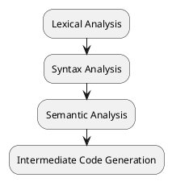
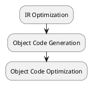

#+title Compiler Anatomy;
#+author: Samuel Jones

* How Does a Compiler Work
- Two main stages: Analysis and Synthesis
  - Analysis translates source code into an intermediate representation (IR) of the program.
  - Synthesis translates IR into target language.

** Graphic Representations of Compiler Stages
#+begin_src plantuml :file analysis.png
:Lexical Analysis;
:Syntax Analysis;
:Semantic Analysis;
:Intermediate Code Generation;
#+end_src

#+RESULTS:

#+begin_src plantuml :file synthesis.png
:IR Optimization;
:Object Code Generation;
:Object Code Optimization;
#+end_src

#+RESULTS:

** Analysis
1) Lexical Analysis: Tokenization of source code.
2) Syntax Analysis: Tokens are grouped using context-free grammar. Then, creates a parse tree.
3) Semantic Analysis: Parse tree is checked for semantic errors.
4) Intermediate Code Generation: An intermediate representation, such as three-address code (TAC), is generated from the parse three.

** Synthesis
1) IR Optimization: Optimizes IR through means like:
   - Removing unreachable segments
   - Removing unused variables
   - Eliminating multiplication by 1 and addition by 0
   - Loop optimization
2) Object Code Generation: Generates assembly code from IR.
3) Object Code Optimization: Optimizes object code; This part may be skipped.

** Other Stuff
*** Symbol Table
- A symbol table contains information about the identifiers in the program, along with information such as type and scope.
- Identifers are found during lexical analysis and added to the symbol table.
- During syntax and semantic analysis, type and scope are added.
*** Error Handling
- Most error occurs before IR generation.

** References
- See [[https://web.stanford.edu/class/archive/cs/cs143/cs143.1128/handouts/020%20CS143%20Course%20Overview.pdf][CS106X Handout]] for more information. This just boils down information from there.
